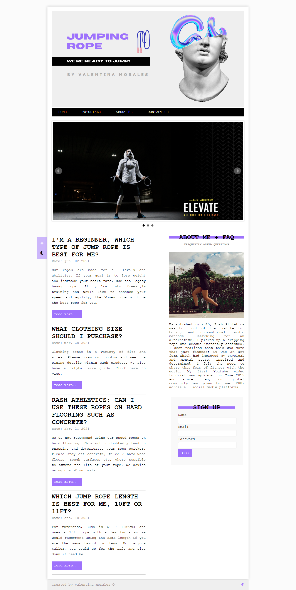

# Web App using JavaScript, JQuery & JQuery UI
## Overview

This is a great small challenge to help get you used to building to a design using javascript, jquery & jquery ui.

### Screenshot

## My process
### Built with

- Semantic HTML5 markup
- CSS custom properties
- LocalStorage
- JQuery
- JQuery UI

## Author

- Website - [valentinacmp](https://github.com/valentinacmp)
- Frontend Mentor - [@valenmp](https://www.frontendmentor.io/profile/valenmp)
# web-application
